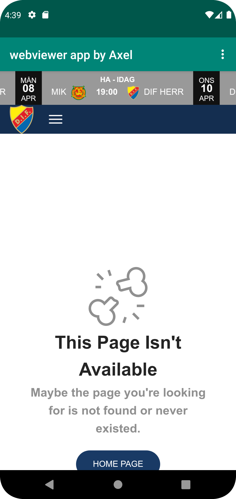
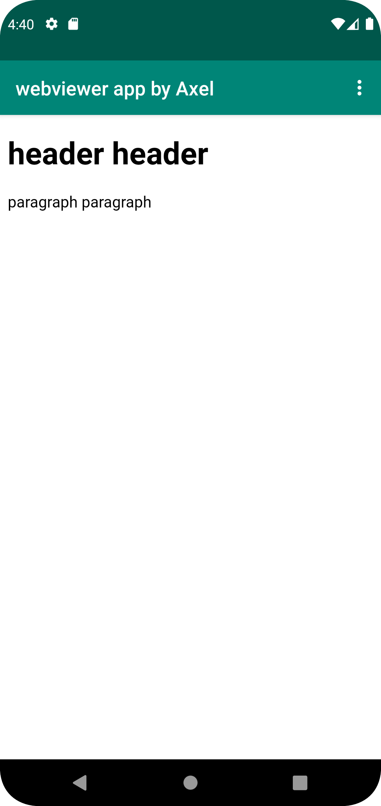

# Rapport

**Skriv din rapport här!**

Under uppgiftens gång gjordes flera saker för att ändra appens textview till en webview.
Det första som gjordes var att ändra koden appens namn. detta gjordes i filen strings.xml och namnet ändrades till "webview app by axel".
Sedan ändrades appen från textview till webview
detta gjordes i filen activity_main.xml kodsegmentet som hanterade textview hittades och döptes om till webview. Nedanstående kod:

android:text="@string/app_name"

Togs bort eftersom webview saknar textelement. utöver det lämnades det som fanns i textview fliken orört eftersom det gick att återanvända.
Det sista som gjorde i dokumentet activity_main.xml var att skapa ett id för den nya webviewen detta gjordes i koden:

android:id="@+id/my_webview".

Sedan möjliggjordes internetåtkomst för appen genom ändringar i filen "AdnroidManifest.xml" genom att lägga tilll koden

uses-permission android:name="android.permission.INTERNET"

Sedan gjordes ändringar i filen "MainActivity.java". Först så lades det till kod i metoden "onCreate()" och sedan skapades 
en ny klass för "myWebViewClient" vilket utökar den befintliga WebviewClient. Den kod som lades till var följande:

myWebView = findViewById(R.id.my_webview);

myWebView.getSettings().setJavaScriptEnabled(true);

WebViewClient webViewClient = new MyWebViewClient();
myWebView.setWebViewClient(webViewClient);

Raderna kod gör att först så hämtas id:t för det som sparades i activity_main.xml filen innan. Denna kod sparas i id:t som i sin tur sparas i min variabel
"myWebView". Sedan möjligörs javascript hantering för myWebView. En anpassad WebViewClient skapades från den tidigare nämnda klassen 
MyWebViewClient och döptes till webViewClient för att hantera webbsidornas visning och laddning. 
Genom dessa åtgärder förbereds WebView för att visa både interna och externa webbsidor. 
De interna och externa websidorna specificerades genom koden:

myWebView.loadUrl("hemsidans url")

de hemsidor som användes var djurgården hockeys hemsida som extern webbsida. Som intern hemsida gjordes ett väldigt enkelt html dokument som placerades i en asset mapp
och döptes till "internal.html".
Det sista som gjordes var att kalla på metoderna "showExternalWebPage()" och "showInternalWebPage()" i metoden
"onOptionsItemSelected(MenuItem item)". När allt var gjort såg appens interna och externa webbsidor ut på följande sätt:

